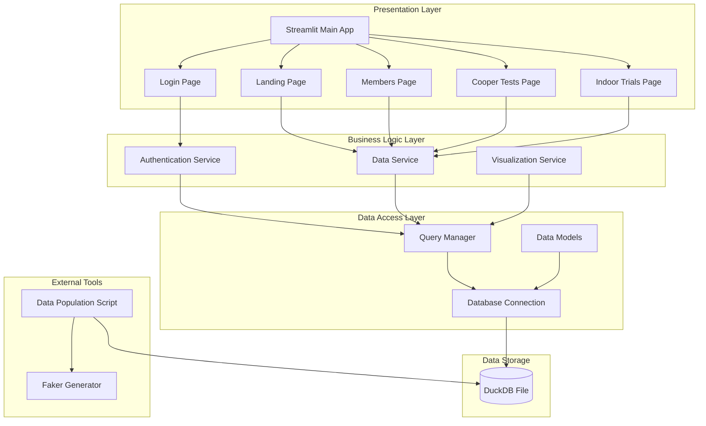

# Design Document

## Overview

The Freediving Management System is designed as a modern, containerized web application using Streamlit for the frontend and DuckDB for data persistence. The system follows a clean architecture pattern with clear separation of concerns between presentation, business logic, and data access layers. The application will be structured as a multi-page Streamlit app with modular components for authentication, data visualization, and database operations.

## Architecture

### High-Level Architecture



### Technology Stack

- **Frontend**: Streamlit 1.50+ for web interface
- **Database**: DuckDB 1.4.1+ for local data storage
- **Data Generation**: Faker 37.12.0+ for synthetic data
- **Environment Management**: uv for Python package management
- **Code Quality**: ruff for linting and formatting
- **Logging**: loguru for structured logging
- **CLI Framework**: Typer for command-line interface
- **Containerization**: Docker for deployment
- **Python Version**: 3.13

## Components and Interfaces

### 1. Application Structure

```
freedive_app/
├── app/                    # Main application package
│   ├── __init__.py
│   ├── main.py            # Streamlit entry point and routing
│   ├── login.py           # Authentication logic
│   └── pages/             # Individual page modules
│       ├── __init__.py
│       ├── landing.py     # Dashboard with KPIs
│       ├── members.py     # Member registry display
│       ├── cooper_tests.py # Cooper test visualizations
│       └── indoor_trials.py # Indoor trial visualizations
├── db/                    # Database layer
│   ├── __init__.py
│   ├── connection.py      # DuckDB connection management
│   ├── schema.sql         # Database schema definition
│   ├── queries.py         # Centralized query functions
│   └── utils.py           # Database utility functions
├── config/                # Configuration management
│   ├── __init__.py
│   └── settings.py        # Application settings and constants
├── scripts/               # Utility scripts
│   ├── __init__.py
│   └── populate_db.py     # Data generation script
└── tests/                 # Test suite
    ├── __init__.py
    └── test_db.py         # Database tests
```

### 2. Authentication Component

**Interface**: `app/login.py`
- Simple credential-based authentication integrated with st.page navigation
- Session state management using Streamlit's session state
- Configurable credentials via environment variables or config files
- Authentication check before page navigation

**Key Functions**:
```python
def authenticate_user(username: str, password: str) -> bool
def check_authentication() -> bool
def logout_user() -> None
def show_login_page() -> None
```

**Integration with st.page**:
```python
# In main.py
from app.login import check_authentication, show_login_page

if not check_authentication():
    show_login_page()
else:
    # Show main navigation and pages
    pg = st.navigation([landing_page, members_page, cooper_page, trials_page])
    pg.run()
```

### 3. Data Population CLI Script

**Interface**: `scripts/populate_db.py`
- Typer-based CLI for generating synthetic data
- Configurable data generation parameters
- Progress indicators and logging
- Data validation and error handling

**CLI Commands**:
```python
# Main command with options
def populate(
    members: int = typer.Option(50, help="Number of members to generate"),
    cooper_tests: int = typer.Option(200, help="Number of Cooper tests to generate"),
    indoor_trials: int = typer.Option(300, help="Number of indoor trials to generate"),
    pool_lengths: List[int] = typer.Option([25, 50], help="Available pool lengths"),
    clear_existing: bool = typer.Option(False, help="Clear existing data before populating"),
    seed: Optional[int] = typer.Option(None, help="Random seed for reproducible data")
) -> None

# Utility commands
def clear_database() -> None  # Clear all data
def validate_data() -> None   # Validate existing data integrity
def export_schema() -> None   # Export database schema
```

**Data Generation Strategy**:
- **Members**: Italian names, realistic ages (16-65), varied membership dates
- **Cooper Tests**: Realistic diving/surface time patterns, performance progression
- **Indoor Trials**: Distance variations based on skill level, optional timing data
- **Relationships**: Ensure referential integrity between members and their tests/trials

**Key Features**:
```python
class DataGenerator:
    def __init__(self, faker_instance: Faker, seed: Optional[int] = None):
        """Initialize with Italian locale for realistic names"""
        
    def generate_member(self) -> Member:
        """Generate realistic freediving member profile"""
        
    def generate_cooper_test(self, member_id: int, pool_length: int) -> CooperTest:
        """Generate realistic Cooper test with diving/surface cycles"""
        
    def generate_indoor_trial(self, member_id: int, pool_length: int) -> IndoorTrial:
        """Generate realistic indoor trial data"""
        
    def generate_realistic_diving_pattern(self) -> Tuple[List[time], List[time]]:
        """Generate realistic diving and surface time patterns"""
```

### 4. Database Layer

**Connection Management**: `db/connection.py`
- Singleton pattern for DuckDB connection
- Connection pooling and error handling
- Automatic database initialization

**Query Interface**: `db/queries.py`
- Centralized query functions for all database operations
- Type-safe query parameters and results
- Caching integration for Streamlit

**Key Functions**:
```python
def get_all_members() -> List[Member]
def get_cooper_tests_by_member(member_id: int) -> List[CooperTest]
def get_indoor_trials_by_member(member_id: int) -> List[IndoorTrial]
def get_database_stats() -> DatabaseStats
```

### 5. Page Components

Using Streamlit's modern `st.page` feature for clean multi-page architecture:

**Main App Structure**: `app/main.py`
```python
import streamlit as st
from app.pages import landing, members, cooper_tests, indoor_trials

# Page configuration
st.set_page_config(
    page_title="Freediving Management System",
    page_icon=":material/pool:",
    layout="wide"
)

# Page definitions using st.page
landing_page = st.page("pages/landing.py", title="Dashboard", icon=":material/dashboard:")
members_page = st.page("pages/members.py", title="Members", icon=":material/group:")
cooper_page = st.page("pages/cooper_tests.py", title="Cooper Tests", icon=":material/timer:")
trials_page = st.page("pages/indoor_trials.py", title="Indoor Trials", icon=":material/pool:")

# Navigation
pg = st.navigation([landing_page, members_page, cooper_page, trials_page])
pg.run()
```

**Page Interface Pattern**:
Each page file follows this structure:
```python
import streamlit as st
from loguru import logger

@st.cache_data
def load_data() -> Any:
    """Data loading with caching"""
    
def create_visualizations(data: Any) -> None:
    """Chart and table generation"""

# Main page content (executed when page is selected)
st.title("Page Title")
data = load_data()
create_visualizations(data)
```

## Data Models

### Database Schema

```sql
-- Members table
CREATE TABLE members (
    id INTEGER PRIMARY KEY,
    name VARCHAR(100) NOT NULL,
    surname VARCHAR(100) NOT NULL,
    date_of_birth DATE NOT NULL,
    contact_info VARCHAR(255),
    membership_start_date DATE NOT NULL,
    created_at TIMESTAMP DEFAULT CURRENT_TIMESTAMP
);

-- Cooper tests table
CREATE TABLE cooper_tests (
    id INTEGER PRIMARY KEY,
    member_id INTEGER NOT NULL,
    test_date DATE NOT NULL,
    diving_times TIME[] NOT NULL,     -- Array of diving times
    surface_times TIME[] NOT NULL,    -- Array of surface times
    pool_length_meters INTEGER NOT NULL, -- Swimming pool length (e.g., 25m)
    notes TEXT,
    created_at TIMESTAMP DEFAULT CURRENT_TIMESTAMP,
    FOREIGN KEY (member_id) REFERENCES members(id)
);

-- Indoor trials table
CREATE TABLE indoor_trials (
    id INTEGER PRIMARY KEY,
    member_id INTEGER NOT NULL,
    trial_date DATE NOT NULL,
    location VARCHAR(255),
    distance_meters INTEGER NOT NULL,
    time_seconds INTEGER,  -- Optional: sometimes only distance is tracked
    pool_length_meters INTEGER NOT NULL, -- Swimming pool length (e.g., 25m)
    created_at TIMESTAMP DEFAULT CURRENT_TIMESTAMP,
    FOREIGN KEY (member_id) REFERENCES members(id)
);
```

### Python Data Models

Using dataclasses for type safety and validation:

```python
@dataclass
class Member:
    id: int
    name: str
    surname: str
    date_of_birth: date
    contact_info: Optional[str]
    membership_start_date: date
    created_at: datetime

@dataclass
class CooperTest:
    id: int
    member_id: int
    test_date: date
    diving_times: List[time]  # List of diving times
    surface_times: List[time]  # List of surface times
    pool_length_meters: int   # Swimming pool length (e.g., 25m)
    notes: Optional[str]
    created_at: datetime

@dataclass
class IndoorTrial:
    id: int
    member_id: int
    trial_date: date
    location: Optional[str]
    distance_meters: int
    time_seconds: Optional[int]  # Optional: sometimes only distance is tracked
    pool_length_meters: int      # Swimming pool length (e.g., 25m)
    created_at: datetime
```

### Visualization Data Models

```python
@dataclass
class PerformanceTrend:
    member_name: str
    dates: List[date]
    values: List[float]
    metric_type: str

@dataclass
class DatabaseStats:
    total_members: int
    total_cooper_tests: int
    total_indoor_trials: int
    database_size_mb: float
```

## Error Handling

### Database Error Handling

1. **Connection Errors**: Graceful fallback with user-friendly messages
2. **Query Errors**: Logging and error reporting without exposing internal details
3. **Data Validation**: Input validation before database operations
4. **Transaction Management**: Proper rollback on failures

### Application Error Handling

1. **Authentication Failures**: Clear error messages without security information leakage
2. **Data Loading Errors**: Fallback to cached data or empty states
3. **Visualization Errors**: Graceful degradation with error notifications
4. **Configuration Errors**: Startup validation and clear error reporting

### Error Logging Strategy

```python
# Simple logging with loguru
from loguru import logger

# Error handling pattern
try:
    result = database_operation()
except DatabaseError as e:
    logger.error(f"Database operation failed: {e}")
    st.error("Unable to load data. Please try again later.")
    return None
```

## Testing Strategy

### Unit Testing

1. **Database Layer Tests**:
   - Connection management
   - Query execution and results
   - Data model validation
   - Error handling scenarios

2. **Business Logic Tests**:
   - Authentication logic
   - Data processing functions
   - Visualization data preparation

3. **Integration Tests**:
   - End-to-end data flow
   - Database schema validation
   - Configuration loading

### Test Data Strategy

1. **Synthetic Test Data**: Use Faker to generate consistent test datasets
2. **Database Fixtures**: Temporary test databases for isolated testing
3. **Mock Data**: Mock external dependencies and database connections
4. **Performance Testing**: Load testing with larger synthetic datasets

### Testing Tools

- **pytest**: Primary testing framework
- **pytest-mock**: Mocking capabilities
- **pytest-cov**: Code coverage reporting
- **Factory Boy**: Test data generation (alternative to Faker for tests)

## Performance Considerations

### Caching Strategy

1. **Streamlit Caching**: Use `@st.cache_data` for database queries
2. **Query Optimization**: Efficient SQL queries with proper indexing
3. **Data Pagination**: Implement pagination for large datasets
4. **Connection Pooling**: Reuse database connections

### Database Optimization

1. **Indexing Strategy**:
   ```sql
   CREATE INDEX idx_cooper_tests_member_date ON cooper_tests(member_id, test_date);
   CREATE INDEX idx_indoor_trials_member_date ON indoor_trials(member_id, trial_date);
   CREATE INDEX idx_members_name ON members(surname, name);
   ```

2. **Query Patterns**: Optimize common query patterns for dashboard KPIs
3. **Data Types**: Use appropriate data types for storage efficiency
4. **Batch Operations**: Efficient bulk data insertion for synthetic data

### Scalability Considerations

1. **File Size Management**: Monitor DuckDB file size growth
2. **Memory Usage**: Efficient data loading and processing
3. **Response Times**: Target sub-second response times for all operations
4. **Concurrent Access**: Handle multiple user sessions appropriately

## Security Considerations

### Authentication Security

1. **Credential Storage**: Environment variables or secure config files
2. **Session Management**: Secure session state handling
3. **Password Handling**: Basic password validation (no plaintext storage)
4. **Access Control**: Page-level access control based on authentication

### Data Security

1. **Input Validation**: Sanitize all user inputs
2. **SQL Injection Prevention**: Use parameterized queries
3. **Data Privacy**: No sensitive personal data exposure in logs
4. **File Permissions**: Appropriate file system permissions for database file

### Deployment Security

1. **Container Security**: Minimal base image and security scanning
2. **Port Exposure**: Only expose necessary ports (8501)
3. **Environment Isolation**: Proper environment variable handling
4. **Logging Security**: No sensitive data in application logs

## Configuration Management

### Application Settings

```python
# config/settings.py
from dataclasses import dataclass
from typing import Dict, Any
import os

@dataclass
class AppConfig:
    database_path: str = "data/freedive.duckdb"
    streamlit_port: int = 8501
    log_level: str = "INFO"
    
    # Authentication settings
    auth_credentials: Dict[str, str] = None
    session_timeout_minutes: int = 60
    
    # Performance settings
    cache_ttl_seconds: int = 300
    max_records_per_page: int = 100
    
    def __post_init__(self):
        # Load from environment variables
        self.database_path = os.getenv("DB_PATH", self.database_path)
        self.log_level = os.getenv("LOG_LEVEL", self.log_level)
```

### Environment Configuration

1. **Development**: Local DuckDB file, debug logging
2. **Production**: Optimized settings, structured logging
3. **Docker**: Container-specific paths and networking
4. **Testing**: In-memory database, verbose logging

## Deployment Architecture

### Docker Configuration

```dockerfile
FROM python:3.13-slim

WORKDIR /app
COPY requirements.txt .
RUN pip install -r requirements.txt

COPY . .
EXPOSE 8501

CMD ["streamlit", "run", "app/main.py", "--server.port=8501", "--server.address=0.0.0.0"]
```

### Development Workflow

1. **Local Development**: `uv run streamlit run app/main.py`
2. **Data Population**: `uv run python scripts/populate_db.py --members 100 --cooper-tests 500`
3. **Testing**: `uv run pytest tests/`
4. **Linting**: `uv run ruff check .`
5. **Formatting**: `uv run ruff format .`
6. **Pre-commit**: Automated quality checks

### CLI Usage Examples

```bash
# Generate default dataset
uv run python scripts/populate_db.py

# Generate larger dataset with specific parameters
uv run python scripts/populate_db.py --members 200 --cooper-tests 1000 --indoor-trials 1500

# Clear and regenerate with seed for reproducibility
uv run python scripts/populate_db.py --clear-existing --seed 42

# Generate data for specific pool configurations
uv run python scripts/populate_db.py --pool-lengths 25 --pool-lengths 50 --pool-lengths 33

# Validate existing data
uv run python scripts/populate_db.py validate-data

# Clear all data
uv run python scripts/populate_db.py clear-database
```

### Production Deployment

1. **Container Build**: `docker build -t freedive_app .`
2. **Container Run**: `docker run -p 8501:8501 -v $(pwd)/data:/app/data freedive_app`
3. **Data Persistence**: Mount volume for DuckDB file
4. **Health Checks**: Container health monitoring
5. **Backup Strategy**: Regular DuckDB file backups